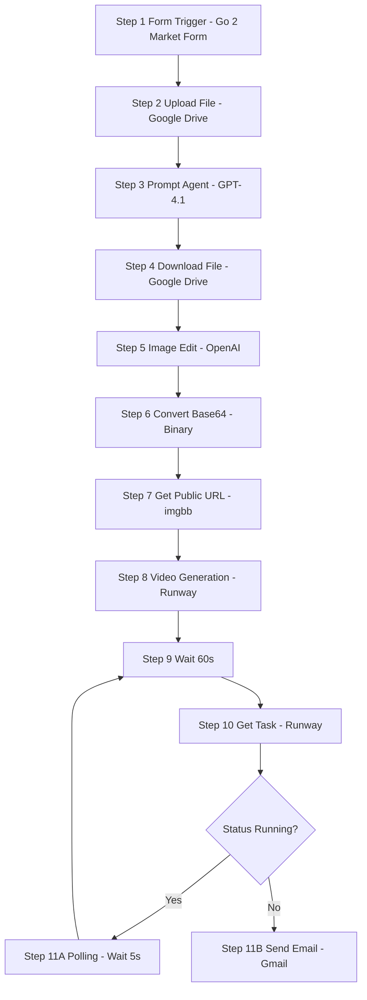

# 🚀 Go2Market Studio — Automated Product Image → Video Marketing Pipeline

      

---

## 📖 Project Overview

**Go2Market Studio** automates the creation of *professional product marketing creatives* from a single form submission. A user uploads a product photo, title, description, and email. The workflow:

1. Saves the original photo to Google Drive for reliable binary reference.
2. Uses a GPT agent (GPT-4.1) to craft a hyper-realistic product photography prompt for image editing.
3. Downloads the original photo (binary) and calls **OpenAI Images Edit** to produce a polished product image.
4. Converts the base64 response to binary, hosts it on **imgbb** to obtain a public URL.
5. Sends the public image URL to **Runway** (image → video) to create a smooth 3D turntable marketing video.
6. Polls the Runway task until completion and emails the final image + video links to the requester.

---

## 🔗 Workflow Image


---

## ✨ Key Benefits

* **Turnkey marketing creatives**: Product photo → professional image → marketing video, automatically.
* **Reproducible & modular**: Nodes separated (Drive, AI prompt, image edit, hosting, video) so you can swap providers.
* **Reliable binary handling**: Upload → Drive → download ensures binary files remain accessible across nodes.
* **Cost-aware**: Runway pricing notes included (e.g., 5s ≈ \$0.25, 10s ≈ \$0.50) so customers can control runtime.
* **Production-ready**: Includes retry/polling pattern, public hosting for third-party APIs, and email delivery.

---

## 🔒 Project Rules (must-follow)

1. **Always upload original files to Google Drive** — binary referencing within n8n is brittle; Drive provides a stable file ID.
2. **Use OpenAI Image *Edit* endpoint**, not create — we edit the original image to maintain realism.
3. **Host final image on a public URL** (imgbb or similar) — Runway requires an HTTP(S) accessible image.
4. **Do not expose API keys in repo** — use n8n credentials or environment variables.
5. **Implement polling with exponential backoff** (base: 5s; max: 30s) and fail-safe after N retries.
6. **Log metadata** for each run: file IDs, task IDs, timestamps, and external URLs.
7. **Privacy**: remove public URLs after N days if product images are private (policy dependent).
8. **Validation**: validate form inputs (file type, size, email format) before processing.
9. **Inform user of expected costs/time** when generating videos (optional UI note).

---

## 🧭 Visual Workflow (Mermaid)



---

## ⚙️ Node-by-node Setup

---

### 🔢 Step 1 — Form Trigger (On form submission)

* **Node Type**: `Webhook` / `Form` (n8n Form)
* **Name**: `On form submission`
* **Form Title**: `Go 2 Market`
* **Form Elements**:

  * `Product Photo` — type: **File**, multiple: allowed, accepted: `.jpg, .png`, **required**
  * `Product Title` — type: **Text**, placeholder: `ToothPaste`, **required**
  * `Product Description` — type: **Text**, placeholder: `Short product summary`, **required**
  * `Email` — type: **Email**, placeholder: `name@example.com`, **required**
* **Respond When**: `Form is submitted`
* **Notes**: Validate file size (< 10 MB recommended) and image type early.

---

### 🔢 Step 2 — Upload File : For Further reference (Google Drive)

* **Node Type**: `Google Drive` (n8n credential: `Google Drive account AIS`)
* **Resource**: `File`
* **Operation**: `Upload`
* **Input Data Field Name**: `Product_Photo` (the binary field from form node)
* **File Name**: `{{ $json['Product Title'] }} (Original)`
* **Parent Drive**: `My Drive`
* **Parent Folder**: `Product Creatives AIS` (create if not exists)
* **Output**: Store `file.id` and `file.webViewLink` in node output for use in step 4.

---

### 🔢 Step 3 — Product Photography Prompt Agent (GPT-4.1)

* **Node Type**: `OpenAI` (GPT-4.1)
* **Name**: `Product Photography Prompt Agent`
* **Source Inputs**:

  * `Product`: `{{ $('On form submission').item.json['Product Title'] }}`
  * `Description`: `{{ $('On form submission').item.json['Product Description'] }}`
* **Require Specific Output Format**: ✅ Enabled
* **Enable Fallback Model**: ✅ Enabled
* **System Message (use exactly or adapt)**:

```text
You are a world-class marketing strategist and expert text-to-image prompt engineer for hyper-realistic product photography.

Objective:
Given a product name and description, output a single concise text-to-image prompt optimized for professional AI image edit models. The prompt must create a hyper-realistic studio photo of the product, emphasizing texture, material, and premium lighting.

Requirements:
- Center the product; maintain full-frame visibility.
- Use softbox/studio lighting; specify shadows and reflections if relevant.
- Background: clean (white, soft gradient, or context-appropriate minimal surface).
- Do not include brand names or text overlays unless requested.
- Keep the prompt ready to paste directly into an image edit API.

Output:
A single line: the final image edit prompt (no additional commentary).
```

* **Example Output**:

```
Hyper-realistic studio photo of a premium turquoise toothpaste tube standing upright on a clean white gradient surface, softbox lighting, soft natural shadows, crisp reflection on the surface, sharp texture on cap and tube, shallow depth of field, 50mm focal length, high detail for packaging and material.
```

---

### 🔢 Step 4 — Download File (Google Drive)

* **Node Type**: `Google Drive` (Download)
* **Operation**: `Download`
* **File**: `By ID` → `{{ $('Upload file : For Further reference').item.json.id }}`
* **Output**: Binary file → pass to next HTTP node as `data` binary field.

---

### 🔢 Step 5 — Create Graphic (OpenAI Images Edit)

* **Node Type**: `HTTP Request` (POST)
* **Method**: `POST`
* **URL**: `https://api.openai.com/v1/images/edits`
* **Auth**: Header Auth → `Open AI AIS` (your OpenAI credential)
* **Body**: `form-data` with fields:

  * `image` → n8n binary file (input field: `data`)
  * `prompt` → `{{ $('Product Photography Prompt Agent').item.json.output }}`
  * `model` → `gpt-image-1`
  * optional: `size` → `1024x1024`
* **Notes**:

  * Use "edits" so OpenAI edits your original photo rather than generating from scratch.
  * Monitor for 200 OK and `data[0].b64_json` in response.

---

### 🔢 Step 6 — Convert Base64 to Binary (Move Base64 String to File)

* **Node Type**: `Move Binary Data`
* **Operation**: `Move Base64 String to File`
* **Base64 Input Field**: `data[0].b64_json`
* **Put Output File in Field**: `data`
* **File Name**: `{{ $json["Product Title"] | slugify }}_final.png` (or similar)
* **Output**: Binary field `data` (ready to upload to public host).

---

### 🔢 Step 7 — Get Public URL : Image BB (imgbb)

* **Node Type**: `HTTP Request` (POST)
* **Method**: `POST`
* **URL**: `https://api.imgbb.com/1/upload`
* **Auth**: Query Auth (imgbb API key)
* **Body**: `form-data`:

  * `image` → n8n binary file (input field: `data`)
  * `key` → `IMG_BB_API_KEY` (in query or header as required)
* **Output**: `data.url` → public image URL used by Runway.

> Alternative: use another host (S3 presigned, Cloudinary, etc.) if you prefer.

---

### 🔢 Step 8 — Generate videos (RUNWAY API)

* **Node Type**: `HTTP Request` (POST)
* **Method**: `POST`
* **URL**: `https://api.dev.runwayml.com/v1/image_to_video`
* **Auth**: Header Auth → `Runway Video AIS`
* **Headers**:

  * `X-Runway-Version: 2024-11-06`
  * `Content-Type: application/json`
* **Body (JSON)**:

```json
{
  "promptImage": "{{ $json.data.url }}",
  "model": "gen4_turbo",
  "ratio": "960:960",
  "promptText": "Create a highly professional marketing video from the provided product photo. Simulate a smooth, realistic 3D turntable rotation around the product, as if the product is slowly rotating in place. The movement should be continuous, slow, and elegant — no sudden pans, jerks, or camera cuts. Always keep the entire product fully in frame, centered, and clearly visible at all times. Avoid zooming in or cropping. Focus on a premium, clean, and modern aesthetic that feels suitable for commercial marketing materials. No flashy effects, transitions, or overlays — only a subtle, realistic 3D rotation that highlights the product in the most polished way possible.",
  "duration": 5
}
```

* **Output**: Runway returns a `task id` (store `id` for polling).

---

### 🔢 Step 9 — Wait 60 Sec (Initial delay)

* **Node Type**: `Wait`
* **Wait Amount**: `60` seconds (initial buffer for Runway processing)

---

### 🔢 Step 10 — Get Videos (RUNWAY API : Get Task details)

* **Node Type**: `HTTP Request` (GET)
* **Method**: `GET`
* **URL**: `https://api.dev.runwayml.com/v1/tasks/{{ $json.id }}`
* **Headers**: `X-Runway-Version: 2024-11-06`
* **Output**: `status` and `output` (contains video URL(s) when ready)

---

### 🔢 Step 11 — IF Node (Status Check)

* **Condition**:

  * `{{ $json.status }}` **is equal to** `RUNNING`

**If True** → Step 11.A (Polling Wait 5 Sec) → loop back to Step 10.
**If False** → Step 11.B → proceed to send email.

---

### 🔢 Step 11.A — Polling (Wait 5 Sec)

* **Node Type**: `Wait`
* **Wait Amount**: `5` seconds
* **Then**: Connect back to Step 10 (GET task).

---

### 🔢 Step 11.B — Send a Finished Products (Gmail)

* **Node Type**: `Gmail`
* **Resource**: `Message`
* **Operation**: `Send`
* **To**: `{{ $('On form submission').item.json['Email'] }}`
* **Subject**: `Your Marketing Materials: {{ $('On form submission').item.json['Product Title'] }}`
* **Message (Text)**:

```
Hi!

Your product creative is ready.

Final image: {{ $('Get Public URL').item.json.data.url }}
Final video: {{ $json.output[0] }}

Thanks,
Go2Market Studio
```

* **Attachment**: You may attach the binary `data` file as well (optional).

---

## ✅ Example Input & Example Outputs

**Example Form Input**

```yaml
Product Title: "AquaPure Toothpaste"
Product Description: "A premium fluoride toothpaste with whitening microbeads and a mint-fresh scent. Sleek matte tube with metallic cap."
Email: "sachin@example.com"
Product Photo: (uploaded JPG, 3000x2000)
```

**Example Generated Image Prompt (GPT output)**

```
Hyper-realistic studio photo of a matte turquoise toothpaste tube with metallic cap standing upright on a clean white gradient surface, softbox lighting, soft natural shadows, subtle reflection on surface, close-up detail on tube texture and cap, shallow depth of field, high-detail packaging, professional e-commerce shot.
```

**Example Runway Video Prompt (sent as promptText)**

```
Create a smooth 3D turntable marketing video from the provided product photo. Rotate the camera slowly around the product for 5 seconds, keep product centered and fully visible, avoid cuts/zoom, maintain premium lighting and minimal background, subtle reflection on surface.
```

**Example Outputs**

```yaml
Image Public URL: https://i.imgbb.com/your_image_key.jpg
Runway Task ID: rwy_task_123456
Video URL (Runway): https://runway.app/video/abc123.mp4
Email Sent To: sachin@example.com
```

---

## 🧩 Quickstart (Deploy in 10–15 minutes)

1. Fork/clone this repo.
2. Upload your n8n workflow JSON (or import node-by-node) — **replace** `PASTE_N8N_TEMPLATE_LINK_HERE` with your n8n JSON link.
3. Create credentials in n8n:

   * Google Drive (OAuth)
   * OpenAI (Header key)
   * imgbb (API key) or your public hosting provider
   * Runway Video (API key)
   * Gmail (OAuth)
4. Update nodes’ `{{ }}` placeholders with your n8n expressions/IDs.
5. Test with a small sample photo (recommended).
6. Observe logs & Runway task polling; adjust wait/poll intervals as needed.

---

## 🛠 Troubleshooting & Tips

* **Runway fails to fetch image** → ensure the imgbb URL is publicly accessible (no auth).
* **Large files time out** → resize images to a max width (2048px) before uploading.
* **OpenAI edit artifacts** → experiment with prompt specificity (lighting, texture, focal length).
* **High latency** from Runway → increase initial wait to 90s for larger images or long queue times.
* **Cost control** → surface run-time and cost to user before generating video.

---

## 📦 Free Template (n8n workflow)

- **Download**: [Product Video Generation Workflow Template](https://github.com/SachinSavkare/Product-Video-Generation-Workflow-n8n/blob/main/5.%20Product%20video%20Generation%20Workflow.json)
 
---


## 👨‍💻 Author

**Sachin Savkare** — 📧 `sachinsavkare08@gmail.com`
*Created for: Product Video Generation Workflow / Go2Market Studio*

---

#
